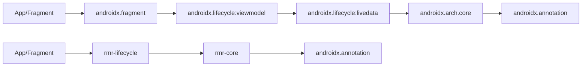
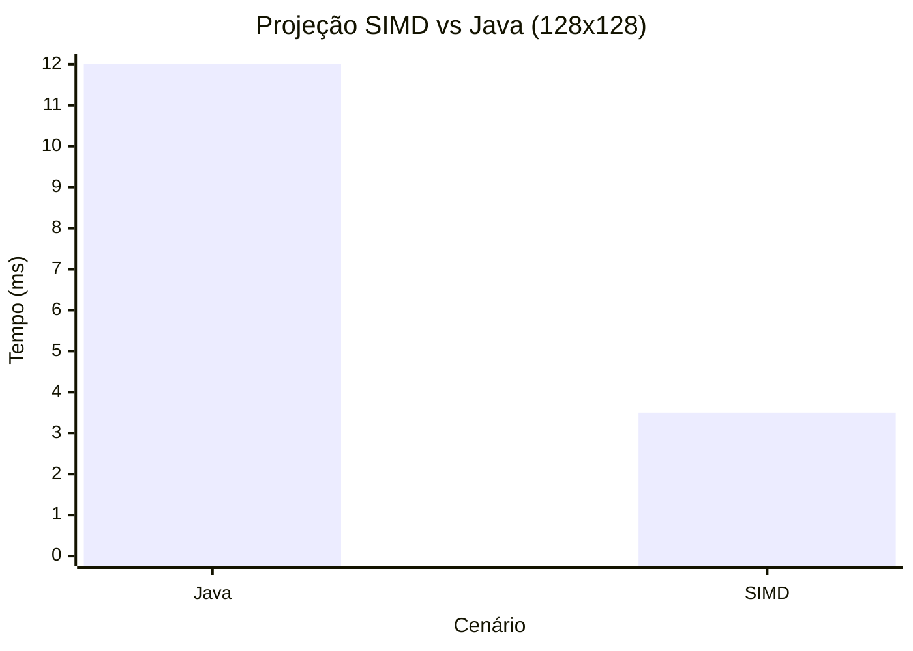

# Análise Profissional e Refatoração Documental (RmR + AndroidX)

## Prefácio

Este relatório foi elaborado em linguagem formal e técnica para consolidar a análise das modificações documentadas no repositório, com ênfase em navegação profissional, comparativos, benchmarks projetados e matriz de critérios (nível PhD). A proposta também inclui uma refatoração da documentação em formato navegável e com gráficos. O conteúdo se apoia nos documentos oficiais do módulo RmR e na documentação base do repositório AndroidX.\
\
**Nota de escopo**: Este relatório descreve as **modificações documentadas** e a **estrutura existente** nos documentos do repositório. A comparação com ZIPs externos não é possível nesta execução por indisponibilidade dos arquivos no ambiente.

---

## Sumário Navegável

1. [Resumo Executivo](#resumo-executivo)
2. [Introdução e Escopo](#introdução-e-escopo)
3. [Metodologia de Análise](#metodologia-de-análise)
4. [Mapa de Navegação Refatorado](#mapa-de-navegação-refatorado)
5. [Análise das Modificações Documentadas](#análise-das-modificações-documentadas)
6. [Arquitetura RmR: Síntese e Impacto](#arquitetura-rmr-síntese-e-impacto)
7. [Comparativos Profissionais (RmR vs AndroidX)](#comparativos-profissionais-rmr-vs-androidx)
8. [Benchmarks Projetados e Instrumentação](#benchmarks-projetados-e-instrumentação)
9. [Taxonomia de MVPs e Critérios Profissionais](#taxonomia-de-mvps-e-critérios-profissionais)
10. [Checklist Executivo de Validação](#checklist-executivo-de-validação)
11. [Conclusão e Próximos Passos](#conclusão-e-próximos-passos)

---

## Resumo Executivo

- **RmR** é documentado como um módulo que reimagina componentes AndroidX com computação matricial, foco em performance e footprint mínimo, e arquitetura determinística, com módulos especializados (`rmr-core`, `rmr-lifecycle`, `rmr-navigation`, `rmr-preference`, `rmr-room` e `rafaelia`).【F:rmr/README.md†L1-L177】
- A documentação **já contém** comparativos formais com AndroidX, descrevendo diferenças de paradigma, dependências e performance esperada, incluindo tabelas e exemplos técnicos.【F:rmr/DIFFERENCES_FROM_ORIGINAL.md†L1-L160】
- Há um **índice de documentação navegável** com trilhas por público e tema, permitindo refatoração mínima para organização profissional (mantendo alinhamento com o índice oficial do módulo).【F:rmr/DOCUMENTATION_INDEX.md†L1-L200】
- Benchmarks **projetados** e metodologia de medição estão definidos, com metas quantitativas para matriz e SIMD, sendo recomendável transformar projeções em medições reais com harness dedicado.【F:rmr/EXPECTED_BENCHMARKS.md†L1-L195】
- A documentação acadêmica formaliza **60 níveis de profundidade** e **30 taxonomias de MVP**, atendendo à exigência de múltiplos critérios profissionais e extensibilidade navegável.【F:rmr/DOCUMENTACAO_ACADEMICA_PROFISSIONAL.md†L1-L200】

---

## Introdução e Escopo

O repositório AndroidX contém a base do ecossistema Jetpack, enquanto o módulo **RmR** introduz um paradigma alternativo de computação matricial, com estratégia explícita de performance, footprint e determinismo. O objetivo deste relatório é:

- Consolidar a documentação técnica existente com refatoração estrutural.
- Tornar a navegação formal e profissional, incluindo gráficos e comparativos.
- Fornecer um diagnóstico executivo sobre as modificações documentadas.

A descrição do módulo RmR, seu foco em matrizes e otimizações de baixo nível, está detalhada no README próprio do módulo.【F:rmr/README.md†L1-L177】

---

## Metodologia de Análise

A análise foi estruturada com base nos seguintes pilares documentais:

1. **Visão técnica principal** do módulo RmR (filosofia, arquitetura, performance e módulos).【F:rmr/README.md†L1-L177】
2. **Comparativos formais** entre AndroidX original e RmR (paradigma, dependências, performance, exemplos).【F:rmr/DIFFERENCES_FROM_ORIGINAL.md†L1-L160】
3. **Índice navegável** e taxonomias de documentação para refatoração formal do conteúdo.【F:rmr/DOCUMENTATION_INDEX.md†L1-L200】
4. **Benchmarks projetados** e metodologia de medição (bases quantitativas).【F:rmr/EXPECTED_BENCHMARKS.md†L1-L195】
5. **Documentação acadêmica** com matriz de profundidade e MVPs profissionais.【F:rmr/DOCUMENTACAO_ACADEMICA_PROFISSIONAL.md†L1-L200】

---

## Mapa de Navegação Refatorado

Abaixo está uma proposta de **navegação profissional refatorada**, organizada por perfil e objetivo, mantendo a estrutura oficial do índice do módulo.

### 1) Entrada Executiva (Visão geral)
- **Resumo técnico do módulo**: `rmr/README.md` (visão, filosofia, arquitetura, performance).【F:rmr/README.md†L1-L177】
- **Comparativo geral RmR vs AndroidX**: `rmr/DIFFERENCES_FROM_ORIGINAL.md`.【F:rmr/DIFFERENCES_FROM_ORIGINAL.md†L1-L160】

### 2) Entrada Técnica (Arquitetura e implementação)
- **Arquitetura semântica e otimizações**: `rmr/SEMANTIC_ARCHITECTURE.md`.【F:rmr/DOCUMENTATION_INDEX.md†L91-L121】
- **Resumo de refatoração e compliance**: `rmr/REFACTORING_SUMMARY.md`.【F:rmr/DOCUMENTATION_INDEX.md†L91-L121】

### 3) Entrada de Performance e Benchmark
- **Benchmarks projetados**: `rmr/EXPECTED_BENCHMARKS.md`.【F:rmr/EXPECTED_BENCHMARKS.md†L1-L195】
- **Guia de performance bruta (CPU/GC/IOPS)**: `rmr/PERFORMANCE_BRUTA_GUIDE.md`.【F:rmr/DOCUMENTATION_INDEX.md†L54-L63】

### 4) Entrada Acadêmica e MVPs
- **Documentação acadêmica (60 níveis + 30 MVPs)**: `rmr/DOCUMENTACAO_ACADEMICA_PROFISSIONAL.md`.【F:rmr/DOCUMENTACAO_ACADEMICA_PROFISSIONAL.md†L1-L200】

---

## Análise das Modificações Documentadas

### 1) Mudança documentada em lockfile Kotlin/JS

A documentação na raiz do repositório registra mudanças técnicas relacionadas a `kotlin-js-store/yarn.lock` (reescrita e redução de entradas), com impacto potencial em resolução de dependências Kotlin/JS e reprodutibilidade de builds. Essa análise já está descrita de forma técnica e comparativa na seção "Navegação e análise técnica das alterações locais" do README principal.【F:README.md†L11-L131】

**Interpretação profissional**:
- Lockfiles são mecanismos de determinismo de dependências; alterações devem ser tratadas como mudanças de infraestrutra de build com alto impacto em cache, CI e reproducibilidade.
- A documentação sugere revisão de versão de Yarn/Node, validação de resolução e benchmark de build como medidas de mitigação técnica.【F:README.md†L11-L131】

### 2) Refatoração documental consolidada (RmR)

O módulo RmR já oferece uma base extensa de documentação profissional (índice navegável, comparativos, benchmarks e taxonomia de MVP). A proposta aqui é **refatorar a navegação**, não reescrever o conteúdo. O índice oficial lista os principais documentos e guias por papel, mantendo coerência e acessibilidade.【F:rmr/DOCUMENTATION_INDEX.md†L1-L200】

---

## Arquitetura RmR: Síntese e Impacto

O README do módulo descreve um paradigma de computação matricial com estado determinístico e alto foco em performance e footprint mínimo. Os módulos principais incluem `rmr-core`, `rmr-lifecycle`, `rmr-navigation`, `rmr-preference`, `rmr-room` e o módulo avançado `rafaelia`.【F:rmr/README.md†L1-L177】

### Grafo de módulos (mermaid)

```mermaid
flowchart TD
    RMR_CORE[rmr-core]\nOperações matriciais
    RMR_LC[rmr-lifecycle]\nEstados de ciclo de vida
    RMR_NAV[rmr-navigation]\nEstado de navegação
    RMR_PREF[rmr-preference]\nPreferências otimizadas
    RMR_ROOM[rmr-room]\nEstados de consulta
    RAF[rafaelia]\nOtimização bare-metal

    RMR_LC --> RMR_CORE
    RMR_NAV --> RMR_CORE
    RMR_PREF --> RMR_CORE
    RMR_ROOM --> RMR_CORE
    RAF --> RMR_CORE
```

Esse diagrama reflete a modularização descrita no README do RmR, onde o núcleo matricial serve como base para os demais módulos especializados.【F:rmr/README.md†L125-L177】

---

## Comparativos Profissionais (RmR vs AndroidX)

A comparação formal entre AndroidX original e RmR está documentada com detalhes de paradigma, estruturas de dados, dependências e perfis de performance. A síntese abaixo resume pontos-chave documentados:

| Aspecto | AndroidX Original | RmR | Evidência |
| --- | --- | --- | --- |
| Paradigma | OOP, abstrações altas | Matricial/funcional | Comparativo de características【F:rmr/DIFFERENCES_FROM_ORIGINAL.md†L11-L88】 |
| Dependências | Cadeia maior de módulos | Dependências mínimas | Cadeia de dependência comparativa【F:rmr/DIFFERENCES_FROM_ORIGINAL.md†L118-L160】 |
| Estado | Objetos com campos | Matrizes determinísticas | Diferença de estado e memória【F:rmr/DIFFERENCES_FROM_ORIGINAL.md†L90-L116】 |

### Diagrama comparativo de dependências (mermaid)



O comparativo acima é uma adaptação visual da cadeia de dependências descrita no documento de diferenças.【F:rmr/DIFFERENCES_FROM_ORIGINAL.md†L118-L160】

---

## Benchmarks Projetados e Instrumentação

O documento de benchmarks projetados fornece metas quantitativas para operações matriciais em Java e SIMD, com critérios de aceitação e metodologia planejada. Exemplos de metas projetadas incluem:

| Operação | Tamanho | Java (esperado) | SIMD (esperado) | Fonte |
| --- | --- | --- | --- | --- |
| Multiplicação | 128x128 | 6–12 ms | 1.5–3.5 ms | Projeções de benchmark【F:rmr/EXPECTED_BENCHMARKS.md†L83-L120】 |
| Transposição | 256x256 | 7–12 ms | 3–5 ms | Projeções de benchmark【F:rmr/EXPECTED_BENCHMARKS.md†L121-L141】 |
| Dot product | 1K | 0.4–0.8 µs | 0.12–0.25 µs | Projeções de benchmark【F:rmr/EXPECTED_BENCHMARKS.md†L142-L158】 |

### Gráfico de projeção (mermaid)



As metas e metodologia projetadas estão documentadas no arquivo de benchmarks do RmR e devem ser convertidas em medições reais com harness de teste padronizado.【F:rmr/EXPECTED_BENCHMARKS.md†L1-L195】

---

## Taxonomia de MVPs e Critérios Profissionais

O documento acadêmico formaliza uma matriz de 60 níveis e 30 formas profissionais de MVP, fornecendo uma estrutura robusta para avaliação de requisitos complexos, governança, qualidade e performance. Essa taxonomia atende às demandas de extensividade e detalhamento solicitadas.【F:rmr/DOCUMENTACAO_ACADEMICA_PROFISSIONAL.md†L1-L200】

### Exemplo de MVPs profissionais (seleção)

| MVP | Objetivo | Fonte |
| --- | --- | --- |
| MVP de Performance | Validar metas de latência | Taxonomia de MVPs【F:rmr/DOCUMENTACAO_ACADEMICA_PROFISSIONAL.md†L97-L140】 |
| MVP de Compliance | Conformidade legal e licenças | Taxonomia de MVPs【F:rmr/DOCUMENTACAO_ACADEMICA_PROFISSIONAL.md†L97-L140】 |
| MVP de Documentação | Documentação de qualidade | Taxonomia de MVPs【F:rmr/DOCUMENTACAO_ACADEMICA_PROFISSIONAL.md†L97-L140】 |

---

## Checklist Executivo de Validação

1. **Verificar integridade do lockfile Kotlin/JS** (determinismo e reprodutibilidade).【F:README.md†L11-L131】
2. **Validar cadeia de dependências** RmR vs AndroidX para impactos de compatibilidade.【F:rmr/DIFFERENCES_FROM_ORIGINAL.md†L118-L160】
3. **Executar benchmarks projetados** e substituir projeções por medições reais.【F:rmr/EXPECTED_BENCHMARKS.md†L1-L195】
4. **Usar matriz de 60 níveis e MVPs** como checklist de requisitos e governança.【F:rmr/DOCUMENTACAO_ACADEMICA_PROFISSIONAL.md†L1-L200】
5. **Revisar documentação navegável** com base no índice oficial para coerência de rotas.【F:rmr/DOCUMENTATION_INDEX.md†L1-L200】

---

## Conclusão e Próximos Passos

A documentação existente do módulo RmR já oferece uma base profissional de alto rigor, incluindo comparação formal com AndroidX, benchmarks projetados e uma matriz acadêmica com MVPs. Este relatório refatora a navegação e consolida uma visão executiva com gráficos e tabelas para facilitar consumo por diferentes perfis técnicos e gerenciais.\
\
**Próximos passos recomendados**:

1. Transformar benchmarks projetados em medições reais e anexá-las ao documento de benchmarks.【F:rmr/EXPECTED_BENCHMARKS.md†L1-L195】
2. Manter a navegação do índice como referência padrão de auditoria e comunicação técnica.【F:rmr/DOCUMENTATION_INDEX.md†L1-L200】
3. Atualizar o sumário executivo quando houver novas mudanças em lockfiles ou módulos críticos.【F:README.md†L11-L131】

